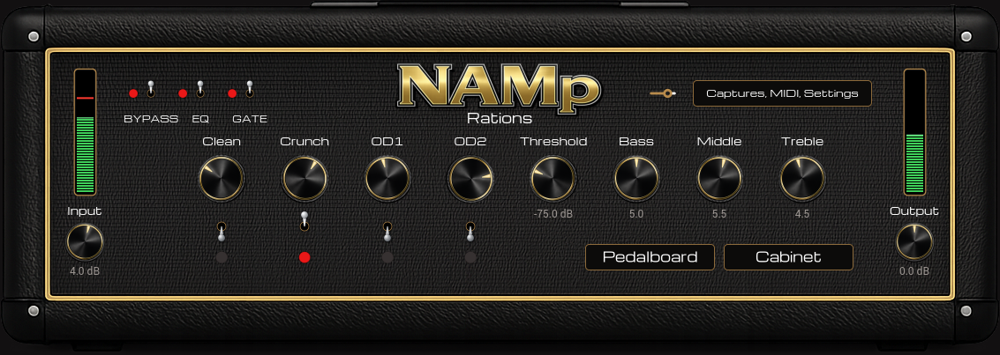
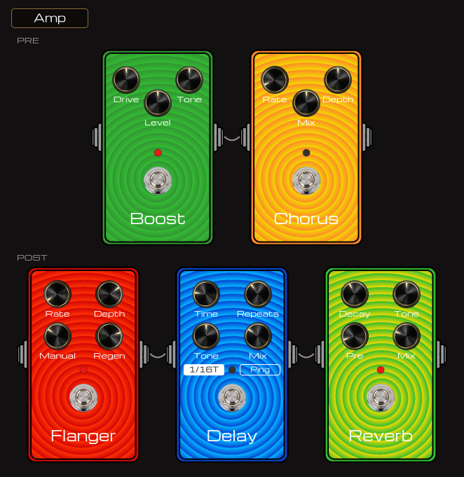

# NAMp Rations





A four-channel amp head built on [Neural Amp Modeler](https://github.com/sdatkinson/neural-amp-modeler)
captures. A **raw VST3** plug-in — no JUCE, no iPlug2, no VSTGUI — for **Linux and Windows**, plus
a JACK standalone on Linux for playing it without a DAW. There is also an
**[experimental macOS build](#macos-experimental)**, which nobody involved has been able to play
yet — read that section before downloading it.

A `.nam` capture freezes an amp at one knob position on one channel. A real amp head has several
channels, each with its own gain range, and you change channel with your foot mid-song. NAMp Rations
gives you that back.

## What it is

**Four channels — Clean, Crunch, OD1 and OD2 until you rename them.** Each loads its own bank of
captures, and its dial sweeps that whole bank *continuously*: rest on one capture and you are
playing it exactly, in between you are hearing the two either side blended. Capture your amp at
each mark of its own gain control and that dial is the amp's gain control, at the amp's own
spacing.
You need to number your captures 1 to 10. Example Gain-1.nam Gain-2.nam etc. Each bank loads up to 64 captures at a time, so you can load folders of all different captures if you like.

**Exactly one channel sounds at a time**, chosen by a bat switch or a MIDI footswitch. The change
is instant and inaudible — about 18 ms, with no click and no gap — which is the whole reason this
plug-in exists. It is not a crossfade over a hard swap: the three idle channels are fed
continuously on a worker thread so the one you stomp to is already exact when you get there.

**Around them:** a shared Threshold / Bass / Middle / Treble section, Input and Output, and BYPASS
/ EQ / GATE. A cabinet page that loads one or two impulse responses with a blend between them. A
pedalboard of five pedals — Boost and Chorus before the amp, Flanger, Delay and Reverb after it.
A settings page behind the "Captures, MIDI, Settings" button, top right, carrying the capture
loaders, a trim per channel, the MIDI-learn rows and the output section.

**You load your own captures.** Nothing ships in the bundle — a fresh instance comes up with four
empty channels, which is an ordinary state rather than an error. Point each loader at a folder of
`.nam` files or at a single one; the folder's name becomes the channel's name, and you can type
over it.

Captures must be feed-forward (WaveNet or ConvNet). An LSTM capture is refused rather than
silently accepted, because the click-free sweep rests on the model's output being a function of a
bounded input window, and an LSTM's cell state has unbounded memory.

## Installing

Release archives are on the [releases page](https://github.com/rations/NAMp-rations/releases) — a
tarball for Linux, a ZIP for Windows, and a ZIP for macOS which is
[experimental](#macos-experimental). To build it yourself instead, see [Building](#building).

Nothing ships with captures: a fresh instance comes up with four empty channels, and the first
thing to do after installing is load your own into them.

### Linux

The tarball holds the plug-in and the standalone, which are the same amp twice — the standalone
*hosts* `NAMp-rations.vst3` rather than duplicating it, so keep the two together.

```
tar xf NAMp-rations-*-linux-x86_64.tar.gz
cd NAMp-rations-*/
./install.sh
```

Everything goes under your home directory and nothing needs root:

| | |
|---|---|
| `~/.vst3/NAMp-rations.vst3` | the plug-in |
| `~/.local/bin/namp-rations-standalone` | the standalone |
| `~/.local/share/applications/` | a menu entry, with an icon |

Then rescan plug-ins in your DAW. `./install.sh --uninstall` removes all three again.

You can also skip the script: copy `NAMp-rations.vst3` into `~/.vst3/` by hand if you only want the
plug-in, and run `./namp-rations-standalone` where you extracted it. cairo, FreeType and fontconfig come
from your system; the standalone additionally wants a JACK server (jackd, or a PipeWire desktop,
which provides one).

### Windows

The ZIP holds `NAMp-rations-install.exe` and the same bundle loose, so you can install it either way.

**With the installer.** Run it. It is not code-signed, so SmartScreen shows a blue "Windows
protected your PC" box — click *More info*, then *Run anyway*, or install by hand instead; the two
put exactly the same folder in exactly the same place. Run it as an administrator and it installs
for everyone in `C:\Program Files\Common Files\VST3`; run it normally and it installs just for you
in `%LOCALAPPDATA%\Programs\Common\VST3`. It tells you which, and you can change the folder.
Remove it later from *Apps & features*.

**By hand.** Copy the whole `NAMp-rations.vst3` **folder** — not a file — into one of those same two
directories, then rescan plug-ins in your DAW. Do not rename anything inside it: the bundle carries
its own art and fonts in `Contents\Resources`, and the binary inside `Contents\x86_64-win` must
keep the name `NAMp-rations.vst3` or no host will load it. To uninstall, delete the folder.

Either way, keep only **one** copy: hosts scan both directories, so a copy in each shows up as two
NAMp Rations entries. There is no runtime to install — cairo, FreeType, libpng and zlib are linked into
the bundle.

### macOS (experimental)

**Read this part before the instructions.** The macOS build is offered as an experiment, and the
honest summary is that it may not work:

- **Nobody who works on this has a Mac.** Linux and Windows are both built and *proved* on one
  Linux machine — Windows works because Wine runs every check on it there. There is no equivalent
  for macOS, so the build is made by GitHub's macOS runners and has never been played by anyone
  who could fix it.
- **The sound is unmeasured on macOS.** On Linux and Windows a set of offline proofs asserts exact
  figures — the channel switch converging on a continuously-running reference to within 1e-6, the
  output modes to three decimal places. Those proofs need capture files, captures are their
  authors' work rather than ours, and so they cannot run on a hosted build machine. What *is*
  checked on both Mac architectures is that the plug-in builds, loads, passes Steinberg's own
  validator, exports exactly the three entry points a host calls, links nothing outside the system,
  and renders all four editor pages, with the Apple Silicon and Intel renders compared against each
  other pixel for pixel. That is a floor, not a guarantee.
- **There is no standalone** — the macOS release is the plug-in only. The Linux standalone is a
  JACK client, so the macOS equivalent would be a different program rather than the same one
  rebuilt.

If it misbehaves, [an issue](https://github.com/rations/NAMp-rations/issues) with your Mac, your
DAW and what happened is genuinely useful — it is the only way any of this gets found.

The bundle is **universal**: one file carrying both Apple Silicon and Intel, macOS 11 (Big Sur) or
later. Nothing else to install — cairo, FreeType, libpng, pixman and zlib are built into it.

**Installing needs Terminal once, for about thirty seconds, and you do not have to type any file
names.** It cannot be done entirely in Finder because the plug-in is not notarized by Apple (that
needs a paid developer account); macOS marks anything downloaded as quarantined and refuses to load
quarantined code that Apple has not signed off, so the flag has to be cleared. `install.sh` does
that for you.

1. **Double-click the .zip** you downloaded. A folder appears beside it.
2. **Open Terminal:** hold **Command** and press the **space bar**, type `terminal`, press
   **Return**.
3. In that window type the four letters `bash` and then **one space**. Do not press Return yet.
4. **Drag the file `install.sh`** out of the folder and drop it onto the Terminal window — its
   location appears after what you typed, so there is nothing to spell.
5. Press **Return**.

It prints `Installed:` and a location. Rescan plug-ins in your DAW and NAMp Rations is there. The
plug-in goes to `~/Library/Audio/Plug-Ins/VST3`; nothing needs an administrator password and
nothing is put outside your home folder.

To remove it, repeat those steps and type one space and `--uninstall` before pressing Return.

If you would rather copy it by hand: drag `NAMp-rations.vst3` into
`~/Library/Audio/Plug-Ins/VST3`, then run `xattr -cr ~/Library/Audio/Plug-Ins/VST3/NAMp-rations.vst3`
in Terminal once. That last step is not optional — without it the DAW finds the plug-in, fails to
load it, and usually does not say why.

## Building

Dependencies are pinned git submodules. cairo, FreeType and fontconfig come from the system.

```
git submodule update --init --recursive NeuralAmpModelerCore AudioDSPTools eigen
git submodule update --init vst3sdk
git -C vst3sdk submodule update --init base cmake pluginterfaces public.sdk
cmake -S . -B build -G Ninja -DCMAKE_BUILD_TYPE=Release
cmake --build build
```

That produces `build/VST3/Release/NAMp-rations.vst3`. Copy it into `~/.vst3/`.

### The standalone (Linux)

The same build also produces `build/namp-rations-standalone` when JACK's development files are present
(`libjack-jackd2-dev`): the amp without a DAW, in a window of its own, with the plug-in's own
editor in it and a MIDI port for a footswitch.

```
./build/namp-rations-standalone
```

It is a **host**, not a second copy of the plug-in: it loads `NAMp-rations.vst3` the way a DAW does —
which is what keeps the editor resolving its art and fonts by the same route in both — looking in
`$RATIONS_VST3`, then beside itself, then the build tree, `~/.vst3`, `/usr/local/lib/vst3` and
`/usr/lib/vst3`. It registers `NAMp-rations:in`, `NAMp-rations:out_l`, `NAMp-rations:out_r` and `NAMp-rations:midi_in`,
connects the audio to the first physical ports it finds, and leaves the MIDI port for you to patch.
What it was playing is kept in `~/.config/NAMp-rations/standalone.state`; `--no-state` starts empty.

`scripts/makedist-linux.sh` packages the two into a tarball with a launcher entry and an
`install.sh`. There is no standalone on Windows — that release is the plug-in only.

### macOS, built on GitHub Actions

There is no macOS build on this repository's own machine and there is not meant to be one: Apple
licenses its SDK for use on Apple hardware, and — decisively — nothing cross-compiled here could be
*run*, because there is no Wine for macOS. So `.github/workflows/macos.yml` builds it on GitHub's
macOS runners, one per architecture, each running its own checks natively before `lipo` joins the
two slices. `scripts/makedist-mac.sh` packages, ad-hoc signs and verifies the result; that signature
is a functional requirement rather than a nicety, since an unsigned arm64 binary is refused by the
kernel.

Building it on a Mac directly is the ordinary CMake sequence above with
`scripts/build-mac-deps.sh` first, which builds the same five graphics libraries at the same pinned
versions into a static sysroot — Homebrew's dylibs would name `/opt/homebrew` and load nowhere
else.

### Windows, cross-built from Linux

No Windows machine and no VM: MinGW-w64, with the graphics dependencies built into a private
static sysroot, verified under Wine.

```
scripts/build-win-deps.sh          # zlib, libpng, pixman, freetype, cairo
cmake -S . -B build-win -G Ninja -DCMAKE_BUILD_TYPE=Release \
      -DCMAKE_TOOLCHAIN_FILE=cmake/toolchain-mingw-w64.cmake
cmake --build build-win
scripts/makedist-windows.sh        # gates, installer, ZIP into dist/
```

Everything is linked statically, so the bundle has no redistributable and nothing sits beside the
binary.

## Testing

The proofs are the point, not an afterthought — a fast channel switch that is not *exact* is a
worse product than a slow one. `tools/` holds offline proofs that drive the built bundle the way a
host does, and `scripts/` holds the gates that run them:

| | |
|---|---|
| `scripts/switch-gate.sh` | the channel switch in a live JACK process callback, zero xruns |
| `scripts/ir-gate.sh` | the two-IR blend against real cabinet impulse responses |
| `scripts/pedal-gate.sh` | each pedal against the source its topology was derived from |
| `rations_switchcheck` | post-catch-up convergence on a running reference to within 1e-6 |
| `rations_racecheck` | the prime worker under ThreadSanitizer |
| `panelrender` | every editor page rendered offline, with art and text-clearance audits |

The offline proofs need capture banks to run against, since the plug-in ships none: pass
`--captures <dir>` (a directory holding one subdirectory per channel) or set
`$RATIONS_TEST_CAPTURES`. `rations_pedalcheck` needs none.

**That last sentence is why macOS is experimental.** Every proof in the table above except
`rations_pedalcheck` and `panelrender` needs captures, a hosted build machine has none, and so none
of them has ever run on macOS. What CI does check there, on both architectures natively, is the
build, the SDK validator, the exported symbols, the linked libraries, the bundled resources, the
pedals, and a pixel-for-pixel comparison of the two architectures' editor renders — which agree on
three of four pages exactly and differ on 35 pixels of the fourth, each by one part in 255, the
dial arcs rounding differently under Apple Silicon's fused multiply-add. Closing the rest means
generating synthetic `.nam` fixtures so the capture-dependent proofs can run anywhere, and that
would close it for all three platforms at once.

## Licence

MIT — see [LICENSE](LICENSE). No GPLv3 code and no JUCE header enters the include graph, which is
a deliberate constraint rather than an accident.

Third-party attribution is in [NOTICE](NOTICE): the VST3 SDK (MIT), NeuralAmpModelerCore and
AudioDSPTools (MIT), Eigen (MPL-2.0), NanoSVG and WDL (zlib), and the fonts (OFL / Apache-2.0).
It matters more for the Windows build than the Linux one, because that bundle statically links
cairo, pixman, FreeType, libpng and zlib and therefore redistributes them.

Captures are not covered by the MIT grant on the code — they are their authors' own work, and
none ship here.
